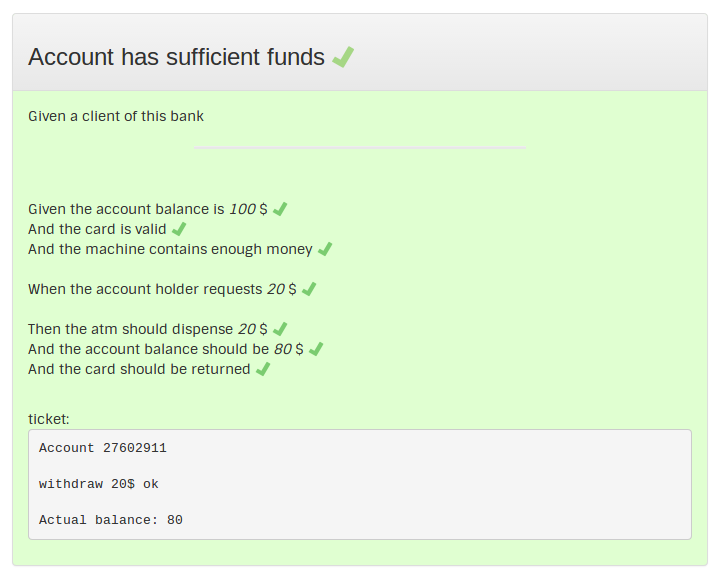
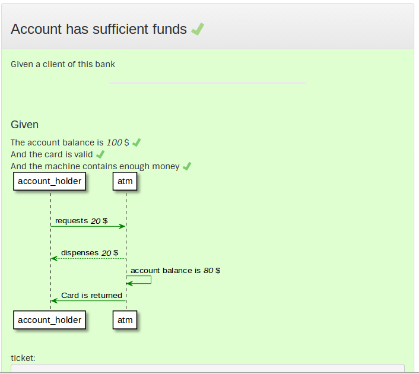

# SFT-tutorial

## Contents
- [Functional and acceptance testing using SimpleFunctionalTest](#functional-and-acceptance-testing-using-simplefunctionaltest)
- [Methods](#methods)
- [Step1: From an unit test to a functional test](#step1-from-an-unit-test-to-a-functional-test)
- [Step2: Re-use fixture](step2-re-use-fixture)
- [Step3: Links use cases together](step3-links-use-cases-together)
- [Step4: Manage context setup and teardown](step4-manage-context-setup-and-teardown)
- [Step5: Displaying context informations](step5-displaying-context-informations)
- [Step6: Decorated use cases](step6-decorated-use-cases)
- [Step7: Decorated use cases](step7-enhance-and-extends)

## Functional and acceptance testing using SimpleFunctionalTest

A quality is an obvious attribute or a property.

Quality assurance, is a way of ensuring the presence of qualities.

This could be done with tests.

In software, many kind of test ensure the quality:

* Unit Test ensure the correctness of an algorithm
* Integration Test ensure the component is integrated
* Benchmark ensure the performance.
* ...

The majority of them can be automatized.

Two kinds of tests ensure the compliance with customer/user needs:

* Acceptance test ensure a needs is developed
* Functional test ensure a functionality

These tests are bridges between human needs and software implementation: implementers are developers (in our case fluent java writers) and recipients are project managers or product owners (less comfortable with code).

SimpleFunctionalTest is a simple way to improve unit tests, to make them readable by non-developers.

## Methods

* The tutorial will used an ATM project as described in [What's in a story?](http://dannorth.net/whats-in-a-story/)
* All source used in this tutorial are available on [github](https://github.com/slezier/SFT-tutoriel); the different steps are versioned in the branches of the same name (step1,step2....).
* This project is build using maven 3.1 and JDK 1.6
* Basic knowledge of unit testing and JUnit 1.4 are needed.

## Step1: From an unit test to a functional test

This unit test can validate a functional need:

_src/test/java/bancomat/WithdrawalsTest.java_:

	...
	public class WithdrawalsTest {

		private SessionDab atmSession;
		private int withdrawals;

		@Test
		public void testWithdrawals() {
			Bank bank = new Bank();
			User user = new User();
			Account account = bank.createAccount(user, 100);
			account.addValidCreditCard("1234");
			Atm atm = bank.getAtm(1000);

			atmSession = atm.authenticate(user);
			withdrawals = atmSession.withdraw(20);

			assertEquals(withdrawals, 20);
			assertEquals(account.balance(), 80);
			assertTrue("Card not returned", atm.returnCard());
		}
	}

As it is not _human readable_, it can't be shared between project manager and developers.

In order to be more inteligible we can humanized the class and method names, extract behaviors named carrefully and add functional context of the test.

_src/test/java/bancomat/AccountHolderWithdrawCash.java_:

	...
	/*
	As an Account Holder  
	I want to withdraw cash from an ATM 
	So that I can get money when the bank is closed
	*/
	public class AccountHolderWithdrawCash {

		private SessionDab atmSession;
		private int withdrawals;
		private Bank bank;
		private User user;
		private Account account;
		private Atm atm;

		@Test
		public void accountHasSufficientFunds() {
			givenTheAccountBalanceIs100Dollars();
			andTheCardIsValid();
			andTheMachineContainsEnoughMoney();

			whenTheAccountHolderRequests20Dollars();

			thenTheAtmShouldDispense20Dollars();
			andTheAccountBalanceShouldBe80Dollars();
			andTheCardShouldBeReturned();
		}

		...

	}

The test is more readable but the issue is still a developer one: a red icon on Jenkins, a maven command outcome, an IDE view of test issue.

By adding the dependency to SimpleFunctionalTest:

pom.xml:

	<project>
		...
		<dependencies> 
			...
			<dependency>
				<groupId>com.github.slezier</groupId>
				<artifactId>SimpleFunctionalTest</artifactId>
				<version>1.8</version>
				<scope>test</scope>
			</dependency>
		</dependencies>
	</project>

and adding SimpleFunctionalTest.class as JUnit runner:

_src/test/java/bancomat/AccountHolderWithdrawCash.java_:

	...
	@RunWith(SimpleFunctionalTest.class)
	public class AccountHolderWithdrawCash {
		...

running the test produce humanized html file that expose the test specification and issue (_target/sft-result/bancomat/AccountHolderWithdrawCash.html_) 

* the class test produces an html file: the _use case_
* the @Test methods produces html paragraph: _scenarios_
* methods call into @Test method are displayed as scenario steps: _fixture call_
* all camel case name are spaced
* comments wrote before method / class are displayed
* the issue of scenario or fixture call or use case is shown using:
    * green check mark when successfull
    * red cross mark when failed
    * yellow interrogation mark when ignored

This web page produce an intelligible way of exposing test issue.

## Step2: Re-use fixture 

While writing a second scenario (test method) in your use case (test class), you propably want to re-use fixture (non public method) with few differences.
Instead wrote a method for each flavor of fixture call, you can specify parameter in the method signature. 
By specifying the expected text using the annotation @Text, you displayed the parameter in the use case report.

_src/test/java/bancomat/AccountHolderWithdrawCash.java_:

	...
	public class AccountHolderWithdrawCash {
        ...
        @Test
        public void accountHasSufficientFunds() {
            givenTheAccountBalanceIs(100);
            andTheCardIsValid();
            andTheMachineContainsEnoughMoney();

            whenTheAccountHolderRequests(20);

            thenTheAtmShouldDispense(20);
            andTheAccountBalanceShouldBe(80);
            andTheCardShouldBeReturned();
        }
        
        ...
        @Text("Given the account balance is ${initialAmount} $")
        private void givenTheAccountBalanceIs(int initialAmount) {
            bank = new Bank();
            user = new User();
            account = bank.createAccount(user, initialAmount);
        }
        ...
        

## Step3: Links use cases together

To ease scenarios management (nominal case, alternate case, error case...), you can call _use case_ each other with an instancied field of the _related use case_.
A new section is added on the report : the list of related use cases. 

_src/test/java/bancomat/AccountHolderWithdrawCash.java_:

	...
	public class AccountHolderWithdrawCash {
        ...
        public  AccountHolderWithdrawCashAlternateCases accountHolderWithdrawCashAlternateCases = new AccountHolderWithdrawCashAlternateCases();
        ...

The related use cases don't need to declare the SimpleFunctionalTest JUnit runner; all public fields of an use case will be run as an related use case.

At this step, you will need to share fixtures between use cases.

Instead share fixtures with inheritance, you can aggregates fixture as public method into _fixtures helper class_.

_src/test/java/bancomat/AccountHolderWithdrawCash.java_:

    ...
    public class BankHelper {

        private Bank bank;
        private User user;
        public Account account;
        ...
    
        @Text("Given the account balance is ${initialAmount} $")
        public void givenTheAccountBalanceIs(int initialAmount) {
            bank = new Bank();
            user = new User();
            account = bank.createAccount(user, initialAmount);
        }

        public void andTheCardIsValid() {
            account.addValidCreditCard("1234");
        }
        ...
        
        @Text("And the account balance should be ${balance} $")
        public void andTheAccountBalanceShouldBe(int balance) {
            assertEquals(account.balance(), balance);
        }
        ...
    }

By declaring these _fixtures helper class_ into your use case as non-public fied with the annotation @FixturesHelper,
you can use these fixtures as _local_ fixtures.

_src/test/java/bancomat/AccountHolderWithdrawCash.java_:

    ...
    public class AccountHolderWithdrawCash {
        ...
        @FixturesHelper
        private BankHelper bankHelper = new BankHelper();

        @Test
        public void accountHasSufficientFunds() {
            bankHelper.givenTheAccountBalanceIs(100);
            bankHelper.andTheCardIsValid();
            bankHelper.andTheMachineContainsEnoughMoney();

            bankHelper.whenTheAccountHolderRequests(20);

            thenTheAtmShouldDispense(20);
            bankHelper.andTheAccountBalanceShouldBe(80);
            bankHelper.andTheCardShouldBeReturned();
        }

        @Text("Then the atm should dispense  ${cash} $")
        private void thenTheAtmShouldDispense(int cash) {
            assertEquals(bankHelper.withdrawals, cash);
        }
        ...

    

## Step4: Manage context setup and teardown

Often use case raise (and terminate) a specific context in which scenario occurs.

SFT re-use JUnit annotation to raise and terminate test context:  

* @Before: executed before each scenario 
* @After: executed after each scenario 
* @BeforeClass: executed once before any scenario
* @AfterClass: executed once after all scenarios

_src/test/java/bancomat/AccountHolderWithdrawCash.java_:

    ...
    public class AccountHolderWithdrawCash {
        ...
        @BeforeClass
        public static void setupUseCase(){
            bankHelper.givenABank();
        }
        @Before
        public void setupScenario(){
            bankHelper.givenAClientOfThisBank();
        }
        ...
        
This context management is displayed when it occurs :

## Step5: Displaying context informations

When running a test, created information or some outcome could be insteresting to displayed.

Thus could be done using non-public field  with @Displayable annotation:

_src/test/java/bancomat/AccountHolderWithdrawCash.java_:

    ...
    public class AccountHolderWithdrawCash {
        ...
        @Displayable
        private String ticket;
        ...
  
This field will be displayed if not null, using the toString() method, after each scenario.

After each scenario this field is set to null.
        
## Step6: Decorated use cases

It's nice but not enough.

The annotation @Decorate add decoration to your functional test.

The decorator shall be specify.

Example:

    @Decorate(decorator = TableOfContent.class)

The annotation could be add to class, test method, fixture method or related use case field, but the decorator specified must be compliant with the item annotated.

For example the TableOfContent add an table of content only when the annotated target is a class

If needed by the decorator parameters could be add:

    @Decorate(decorator = TableOfContent.class, parameters = {"val1"})
    @Decorate(decorator = TableOfContent.class, parameters = {"val1","val2"})

### Use Case: Add Table of content

TableOfContent decorator could be add at class level (use case).

It adds an table of content after use case description, all items links to related use cases and scenarios.

This code:

_src/test/java/bancomat/AccountHolderWithdrawCash.java_:

    ...
    @Decorate(decorator = TableOfContent.class)
    public class AccountHolderWithdrawCash {
        ...

Produces:

     
    
### Use Case: Add Bread crumb

Breadcrumb decorator could be add at class level (use case).

It adds an bread crumb after title.

This code:

_src/test/java/bancomat/AccountHolderWithdrawCashAlternateCases.java_:

    ...    
    @Decorate(decorator = Breadcrumb.class)
    public class AccountHolderWithdrawCashAlternateCases {
        ...

Produces:

     

### Fixture: Display as a table

Table decorator could be add at non-public method level (fixture).

Instead adding text for each fixture call, the decorator presents issue as table.
Parameters names are used as column title. Table title could be specify as parameter.

This code:

_src/test/java/bancomat/AccountHolderWithdrawCashAlternateCases.java_:

    ...
    public class AccountHolderWithdrawCashAlternateCases {
        ...
        @Test
        public void maximumWithdraw(){
            ...
            whenTheAccountHolderRequestsThenTheAtmProvidesCash(10,10);
            whenTheAccountHolderRequestsThenTheAtmProvidesCash(10,10);
            whenTheAccountHolderRequestsThenTheAtmProvidesCash(10,10);
            whenTheAccountHolderRequestsThenTheAtmProvidesCash(10,10);
            whenTheAccountHolderRequestsThenTheAtmProvidesCash(10,10);
            whenTheAccountHolderRequestsThenTheAtmProvidesCash(10, 0);
        }
        ...
        @Decorate(decorator = Table.class,parameters = "withdraws and cash received per visit")
        private void whenTheAccountHolderRequestsThenTheAtmProvidesCash(int amount, int cash) {
        ...

Produces:

     

### Fixture: Group fixtures

Group decorator could be add at non-public method level (fixture).

This  decorator needs a group name as parameter.
All fixture having the same group name are displayed in the same paragraph with the group name as title.

This code:

_src/test/java/bancomat/BankHelper.java_:

    ...
    public class BankHelper {
        ...
        public final static String GIVEN="Given";
        
        ...
        @Decorate(decorator = Group.class,parameters = GIVEN)
        public void andTheCardIsValid() {
            account.addValidCreditCard("1234");
        }

        @Decorate(decorator = Group.class,parameters = GIVEN)
        public void andTheMachineContainsEnoughMoney() {
            atm = bank.getAtm(1000);
        }
        ...

_src/test/java/bancomat/AccountHolderWithdrawCashAlternateCases.java_:

    ...
    public class AccountHolderWithdrawCashAlternateCases {

        ...
        @Test
        public void accountHasInsufficientFunds(){
            bankHelper.theAccountBalanceIs(10);
            bankHelper.andTheCardIsValid();
            bankHelper.andTheMachineContainsEnoughMoney();

            bankHelper.theAccountHolderRequests(20);

            theAtmShouldNotDispenseAnyMoney();
            andTheAtmShouldDisplay("Insufficient funds");
        ...

Produces:

     
        

## Step7: Enhance and Extends

What else ?...

Access custom implementation of community !!!

By adding the dependency to SimpleFunctionalTest plugin (as SequenceDiagramPlugin) :

pom.xml:

	<project>
		...
		<dependencies> 
			...
		        <dependency>
           			 <groupId>com.github.slezier</groupId>
	            		<artifactId>SequenceDiagramPlugin</artifactId>
        	    		<version>0.1</version>
				<scope>test</scope>
        		</dependency>
		</dependencies>
	</project>

adding a Custom configuration using this plugin:

_src/test/java/bancomat/CustomConfiguration.java_:

	...
	public class CustomConfiguration extends DefaultConfiguration {
		public CustomConfiguration() {
			getReport().addDecorator(SequenceDiagram.class, HtmlSequenceDiagram.class);
		}
	}

and using it: 

_src/test/java/bancomat/AccountHolderWithdrawCash.java_:

    ...
    @Using(CustomConfiguration.class)
    public class AccountHolderWithdrawCash {

       ....

       @Test
       public void accountHasSufficientFunds() {
           bankHelper.theAccountBalanceIs(100);
           bankHelper.andTheCardIsValid();
           bankHelper.andTheMachineContainsEnoughMoney();

           bankHelper.requestCash(20);

           dispenseCash(20);
           bankHelper.andTheAccountBalanceShouldBe(80);
           bankHelper.cardIsReturned();
       }

       @Decorate(decorator = SequenceDiagram.class,parameters = "atm --> account_holder")
       @Text("dispenses ${cash} $")
       private void dispenseCash(int cash) {
           this.ticket= bankHelper.getHtmlTicket();
           assertEquals(bankHelper.withdrawals, cash);
       }
       ...
    }

_src/test/java/bancomat/AccountHolderWithdrawCash.java_:

    ...
    public class BankHelper {

        ...
    
        @Decorate(decorator = SequenceDiagram.class,parameters = "account_holder -> atm")
        @Text("requests ${amount} $")
        public void requestCash(int amount) {
            atmSession = atm.authenticate(user);
            withdrawals = atmSession.withdraw(amount);
        }

        @Decorate(decorator = SequenceDiagram.class,parameters = "atm -> atm")
        @Text("account balance is ${balance} $")
        public void andTheAccountBalanceShouldBe(int balance) {
            assertEquals(account.balance(), balance);
        }

        @Decorate(decorator = SequenceDiagram.class,parameters = "atm -> account_holder")
        public void cardIsReturned() {
            assertTrue("Card not returned", atm.returnCard());
        }

        ...
    }

You can access community enhancement (as SequenceDiagram decorator) :

 

And more : 

- Customize html generation with your company copyrigth for example
- Add or change css
- Change decorator behavior 
- Change source and target folder
